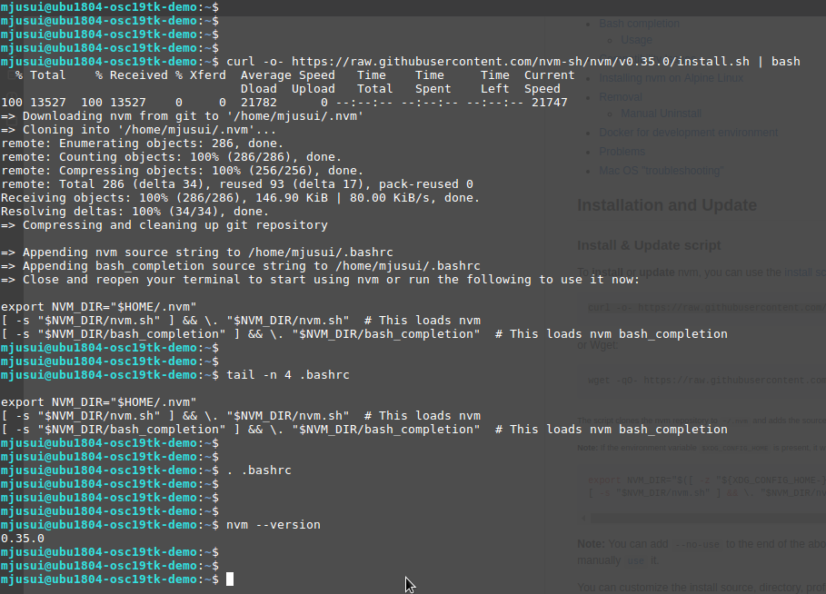
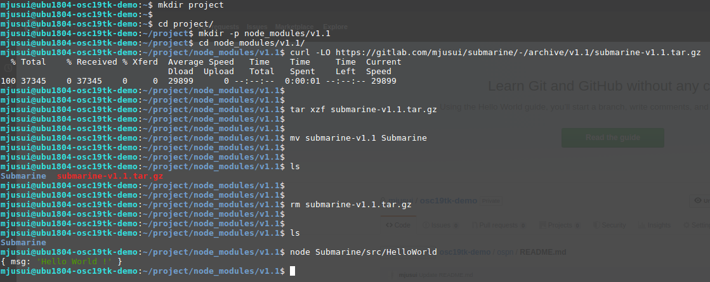

# Submarine.js誕生までの物語

こんなジレンマに陥ったことはありませんか?

```
このPlaybookを実行しても、このroleはスキップされるはず
Ansibleは冪等性を保証しているから、1度サーバに適用したroleはスキップされるはずなんだ……
でも、本当にスキップされるだろうか?
怖くて本番環境で試せない
```

```
ShellScriptなら一瞬で書ける、でもAnsibleで実現する方法が分からない
かといってShellScriptを冪等に書こうとするとif地獄に……
Ansibleはモジュール多すぎて欲しい機能が見つからない
しかもバージョンごとに挙動もモジュール名も違うだと!?
Shellで書くべきか、Ansibleに身を委ねるべきか……
```

```
このサーバは前に作ったこのroleを変数だけ変えて再利用して……
あれ? この変数も必要なんだっけ? この変数どこで使われてるんだ?
え? ディストリビューションごとに条件分岐している?!
なるほど分からん。ようし1から作り直しだ!
```

Ansibleを3年間利用した私は、この全部を経験しました


このような事態に陥る原因のほとんどは、Ansibleを利用するインフラエンジニアが、プログラミングの経験が乏しいために、無計画に無秩序にコードを書きつづけたことによるものです


AnsibleはYAML記法を採用し、豊富なモジュールを提供し、単純な条件分岐とループのみのでコードの実行順序を制御します。これは、プログラミング経験の少ないインフラエンジニアでもシンプルでとっつきやすいようなデザインです。しかし、それゆえにプログラミング言語としては非力な部分も多く、扱い方を間違えると悲惨な結果を招くことになります


昨今コンテナ技術やマイクロサービス、DevOpsやSREという新たな分野の流行に後押しされて、インフラエンジニアといえどもプログラミングのスキルが求められるようになってきています

そういった背景から、現代的な高級言語の特徴を持ち、より安全かつ柔軟な開発を実現する、新しい構成管理・自動化ツールである[Submarine.js](https://gitlab.com/mjusui/submarine)は開発されました


# この記事では

この記事ではSubmarine.jsのインストールと簡単な利用方法からはじめ、Submarine.jsの哲学、さらに応用編として、KVMサーバのリソース状況を管理して、あいているKVMに仮想マシンを自動で構築してくれるアロケーション機能を実装する方法を紹介します

Submarine.jsのベースとなる技術としてJavaScript(Node.js)がありますが、それを厳密に理解していなくても分かるように、詳細に説明していきます

ちなみにOpenStackなどのオーケストレーションツールで実現できることを、あえてSubmarine.jsで実装するのには理由があります。オーケストレーションツールは一般に、導入の際のシステム要件が厳しかったり、1度導入してしまうと、なかなか抜け出せなかったり、新しいバージョンを追いかけてアップグレードをするのが大変だったりと、こちらもこちらで、扱うエンジニアの力量が試されるツールだったりするのです

Submarine.jsを使うと、OpenStackよりかは導入が簡単で、自分たちで欲しい機能を追加したり、不具合を修正したり、別のツールと併用したりといったことができ、小回りの効く方法でオーケストレーションを実現できるようになります


# 目次

* インストールと環境構築
* まずはコードを書いて、動かしてみよう
* Submarine.jsはメンテナの目線でデザインされている
* モダンなJavaScript(Node.js)のパワーを活用しよう - 仮想マシンのアロケーション機能を実装する


# インストールと環境構築

まずはSubmarine.jsのインストールと環境構築をします

※この記事の手順は、Ubuntu18.04にて検証しています

## Node.jsをインストール

Submarine.jsはNode.jsで開発されているため、動作させるためにNode.jsのインストールが必要です

Node.jsはChromeなどのブラウザ上で動作するJavaScriptをサーバサイドでも実行できるようにした画期的なプログラミング言語です

[Node.jsのサイト](https://nodejs.org/en/download/)には、いつくかのインストール手順がありますが、Submarine.jsの[公式リポジトリ](https://gitlab.com/mjusui/submarine/tree/v1.1)に記載されているとおり、[NVMによるインストール](https://nodejs.org/en/download/package-manager/#nvm)をおすすめします

NVMとはNode Version Managerのことで、Node.jsの複数バージョンを簡単に切り替えられる便利なツールです  
RubyのrenvやPythonのpyenvに相当するツールですね

nvmの[githubページ](https://github.com/nvm-sh/nvm#install--update-script)を見るとcurlで一発でインストールできるようにしてくれてます

```
$ curl -o- https://raw.githubusercontent.com/nvm-sh/nvm/v0.35.0/install.sh | bash
$ tail -n 4 .bashrc
$ . .bashrc
$ nvm --version
```





nvmがインストールできたところで、次はいよいよNode.jsをインストールします

Submarine.jsはNode.jsの長期サポート版(LTS)である10.x系(記事執筆時)での動作が保証されていますので、今回は10.x系の最新版をインストールします

```
$ nvm install --lts
$ node --version
```


## Submarine.jsのインストール

次にSubmarine.jsをインストールします  
まずはSubmarine.jsのコードを管理するプロジェクト用のディレクトリを作成します

```
$ mkdir project
```

そしてSubmarine.jsのソースコードをダウンロードします  
Node.jsのパッケージ管理ツールとしてはnpmやyarnがありますが、Submarine.jsは現時点では単にtarballを展開してインストールします  

Submarine.jsの執筆時点での最新バージョンはv1.1です

```
$ cd project
$ mkdir -p node_modules/v1.1
$ cd node_modules/v1.1
$ curl -LO https://gitlab.com/mjusui/submarine/-/archive/v1.1/submarine-v1.1.tar.gz
$ tar xzf submarine-v1.1.tar.gz
$ mv submarine-v1.1 Submarine
$ rm submarine-v1.1.tar.gz
$ node Submarine/src/HelloWorld
```




これでSubmarine.jsが、使えるようになりました


# まずはコードを書いて、動かしてみよう

Submarine.jsがどういうものかはおいておいて、まずはコードを書いて、動かしてみます

JavaScriptやNode.jsの知識があると、ここで登場するコードを深く理解できますが、はじめはそれらの知識は必須ではありません  
Submarine.jsを利用していく中で、少しずつ身に付けていくことをおすすめします

それよりもむしろShellScriptを上手く書く技術があると、Submarine.jsのパワフルさを感じることができるでしょう

## サーバの状態を取得する

projectディレクトリに戻って、以下のファイルを作ってください


```MyHost.js
const Submarine=require('v1.1/Submarine');


const MyHost=class extends Submarine {

  query(){
    return {

      hostname: 'hostname -s',

    };
  }

}


const myhost=new MyHost({
  conn: 'sh',
});


myhost.current()
  .then(console.log)
  .catch(console.error);
```

そしてnodeコマンドで、コードを実行します

```
$ node MyHost.js
```


query関数の中で定義した`hostname -s`がlocalhost上のshで実行され、その結果がJSON形式で表示されます

ではMyHost.jsの中身を、順を追って説明していきます

```MyHost.js
const Submarine=require('v1.1/Submarine');
```

まず一行目。JavaScriptを知らない方からすると、いきなり分からない文字が出てきますが、一つずつ分解してみます

```
const : JavaScriptで定数を宣言する際に、定数の前に書きます。constで定義された定数には、値を再代入できないという特徴があります
require('v1.1/Submarine') : 先ほどnode_modules/v1.1/Submarineに展開したtarballを読み込んでいます
```

`const Submarine=require('v1.1/Submarine');`でSubmarineという定数にv1.1/Submarineから読み込んだものを代入するよ、という意味です
「これからSubmarine.jsのv1.1を使いますよ」と宣言している、という程度の理解で大丈夫です

そして次にMyHostという定数を宣言している部分

```MyHost.js
const MyHost=class extends Submarine {

~

}
```

`class extends Submarine { ~ }`というのは、Submarineクラスを拡張して使う、という意味です  

これは先ほどの`require('v1.1/Submarine');`の部分で、Submarineという定数の中にSubmarine.jsがあらかじめ用意したクラスが代入されているのですが、それに自分が使いたいようにアレンジを加えて使います、ということを宣言しているのです

クラスというのはオブジェクト指向プログラミングの世界の概念なのですが、ここでは単に「Submarine.jsがベースとなるコードをクラスという単位で、あらかじめ、まとめてくれている」というくらいの理解で大丈夫です

そして、いよいよクラスの中のShellコマンドが記述されたqueryという部分

```MyHost.js
  query(){
    return {

      hostname: 'hostname -s',

    };
  }
```

これはSubmarine.jsのクラスがあらかじめ持っているqueryという関数を、自分用にカスタマイズした部分です  
つまりこれは、Submarine.jsのクラスを拡張し、query関数を上書きしたことになります

ここではquery関数が`return { ~ }`で{ ~ }を結果として返すようになっています。この{ ~ }の中に`{ <key>: <ShellScript>, ... }`というフォーマットでShellScriptを記述しておきます。すると、のちに紹介するcurrent関数を実行した際に、Submarine.jsが、query関数のreturn結果をターゲットのサーバにログインして実行します。実行した結果、標準出力に表示された文字列が、最終的なcurrent関数の結果として返されます

query関数がreturnする値はkeyとShellScriptの組み合わせを複数持つこともできます

```MyHost2.js
  query(){
    return {

      hostname: 'hostname -s',

      ip_addrs: String.raw`

        ip -o -f inet a \
          |awk '{print $4}'

      `,

    };
  }
```


上記のようにhostnameだけでなくip_addrsというkeyを追加し、ホストに設定されているIPアドレスの一覧を取得することもできます  
とにかく、この部分は、プログラマが参照したい値を取得するShellScriptを自由に書いていいのです

ここで String.raw\` ~ \` という書き方が新しく出てきました。これは\` ~ \`で囲われた文字列の中のエスケープ処理を無視して、生の文字列として扱うよ、という意味です  
これがあることによって、ShellScriptを文字列として記述しても、わずらわしいエスケープ処理に悩まされずに済むのです  
基本的に複数行にわたるコマンドを書くときには、必ずこれでくくることをおすすめします

また、複数のkeyとShellScriptを指定したことで、コンソール画面への出力結果のJSONにも、hostnameとip_addrsという2つのkeyと値が含まれるようになりました  
ip_addrsはホストのIPアドレスが2つ以上あり、コマンドの実行結果が複数行にわたったため、結果が改行で区切られ、配列に格納されています

これがSubmarine.jsの第一の機能queryです。サーバの状態を確認するコマンドを複数実行してJSON形式にしてくれます

コードの残りの部分についても、説明しましょう

```MyHost.js
const myhost=new MyHost({
  conn: 'sh',
});
```

今度は小文字のmyhost定数に、先ほど定義したclassをnewして代入しています

定数の名前は何でもよいのですが、この`new Class( ~ )`というのは、定義したclassを元にオブジェクトを生成するという意味です  

このオブジェクトというのが、先ほども軽く登場したオブジェクト指向のオブジェクトなのですが、ここでは簡単に「定義したクラスを使いたいときにはnewする必要がある」ということだけ理解しておけばいいでしょう

`new MyHost( ~ )`の括弧の中で`{ conn: 'sh' }`と書かれていますが、これは「ローカルホストの/bin/shでコマンドを実行するよ」という意味です  
この他にも`{ conn: 'bash' }`(=ローカルホストの/bin/bash)や`{ conn: 'ssh', host: '<ip address>'}`(=<ip address>にssh)のように、実行先を指定できます

一度定義したクラスを、newする時に与える引数に応じて、実行先を変えることができるようになっています。これがオブジェクト指向の強みでもあります


そして最後

```MyHost.js
myhost.current()
  .then(console.log)
  .catch(console.error);
```

このcurrentという関数は、Submarine.jsを拡張したクラスのオブジェクトが持っている関数です。queryで定義されたコマンドを実行し、結果をJSON形式で返す働きをします。まさに「サーバの現在の状態(=current state)」を取得する関数なのです

.thenと.catchというのは、queryで定義されたコマンドが全て成功すればthenが呼び出され、1つでもコマンドが失敗すればcatchが呼び出される、という動きをします

`console.log`は引数を標準出力に表示するJavaScriptの機能で、`console.error`はエラー出力に出力します。つまりコマンドが成功したら標準出力、エラーになったらエラー出力に表示する、という処理を、ここでは行っています


以上がSubmarine.js第一の機能であるqueryです。queryというのは、まさに「サーバの現在の状態(=current state)」を問い合わせ(=query)する関数なのです

注意点としては、このqueryはあくまで状態の取得をするための機能なので、サーバの状態に変更を加えるコマンドは記述すべきではないということです。例えば、このquery関数の中で、新しくファイルを作成したり、パッケージをインストールしたりするようなコマンドは、書いてはいけません(書けばサーバに変更を加えることができますが、Submarine.jsでは、これはqueryに書かず、のちに紹介するcommandという関数で書く、というルールを設けています)

## サーバの状態をテストする

query関数では、サーバの状態を取得することができました。今度は取得した状態をテストします  
Submarine.jsでは、サーバの現在の状態が、あるべき状態なのか、そうでないのかを調べるためにtestという関数が用意されています


```MyHost3.js
const Submarine=require('v1.1/Submarine');


const MyHost=class extends Submarine {

  query(){
    return {
      issue: 'cat /etc/issue.net',
    };
  }

  test(stats){
    return {
      ubuntu_is_18_04_3_lts: stats.issue === 'Ubuntu 18.04.3 LTS',
    };
  }

}


const myhost=new MyHost({
  conn: 'sh',
});


myhost.check()
  .then(console.log)
  .catch(console.error);
```


構造は、先ほどquery関数の例で紹介したコードとほぼ同じで、今回はquery関数に`/etc/issue.net`の内容をcatする単純なコマンドが定義されています

そして新しくtestという関数の定義が加えられ、さらに、current関数の変わりにcheck関数を実行しています

このtestという関数が、query関数と同じくSubmarine.jsを拡張しています  
この関数の特性は、current関数の結果(すなわちquery関数で定義したコマンド群の結果)を第一引数として受け取り、それらを文字通りtestする関数となります

上のサンプルでは、queryでUbuntuのバージョン文字列を取得し、testで、その文字列が`Ubuntu 18.04.3 LTS`と一致することを確認しています


このコードを実行すると、画像のようなJSON形式の値が表示されます  
1つずつ、中身を確認していきましょう

```
stats : current関数の結果
tests : test関数でreturnされた結果
good : testsのうちテストをパスした数(trueの数)
bad : testsのうちテストをパスできなかった数(falseの数)
total : テストの数
ok : テストが全てパスした場合はtrue、1つでもパスできなかった場合はfalse
```

Submarine.jsはqueryにより、サーバの現在の状態を取得し、testでサーバが「あるべき状態」かどうか判定するという設計になっています

## サーバに変更を加える

これまでのquery関数やtest関数は、サーバの状態を確認する、いわば読み取り(Read)の処理でしたが、今度は状態を変更する書き込み(Write)の処理を実行します

```MyHost4.js
const Submarine=require('v1.1/Submarine');


const MyHost=class extends Submarine {

  query(){
    return {
      project2_dir: String.raw`

        test \
          -d /home/mjusui/project2 \
        && echo 'present' \
        || echo 'not present'

      `
    };
  }

  test(stats){
    return {
      project2_dir_exists: stats.project2_dir === 'present'
    };
  }

  command(){
    return String.raw`
      dir=/home/mjusui/project2/node_modules/v1.1

      mkdir -p $dir \
      && cd $dir \
      && curl -LO \
        https://gitlab.com/mjusui/submarine/-/archive/v1.1/submarine-v1.1.tar.gz \
      && tar xzf submarine-v1.1.tar.gz \
      && mv submarine-v1.1 Submarine
    `;

  }
}


const myhost=new MyHost({
  conn: 'sh',
});


myhost.correct()
  .then(console.log)
  .catch(console.error);
```

query, testときて、次はcommand関数を実装します

上記のサンプルコードでは、まずquery関数で`/home/mjusui/project2`がディレクトリとして存在している場合は`present`、存在していない場合は`not present`の文字列を返します。そしてtest関数でqueryの結果が`present`であることを確認しています(つまりホームディレクトリにproject2というディレクトリが存在しているか判定していることになります)

command関数の実行には、query関数の実行はcurrent関数、test関数はcheck関数、に対してcorrect関数を使用します

このcorrect関数は「testが失敗(1つでもfalseが含まれる)の場合のみcommandを実行する」という特徴があります。なので今回、新しく登場したcommand関数は「ホームディレクトリにproject2ディレクトリが存在しない場合に実行されるShellScript」を返すように書かれています

correct = 修正する、つまり失敗したテストが成功するように修正するという意味です

サンプルコードではcommand関数が呼び出された場合には`/home/mjusui/project2`を作成し、Submarine.jsを使えるようセットアップするShellScriptが定義されています(この記事でも紹介した手順です)

これをnodeコマンドで実行した結果が、下のスクリーンショットとなります


実行する前はproject2ディレクトリは存在しませんでしたが、1度の実行した後に生成されています。また、この記事で紹介したとおりHelloWorldが実行できていることから、Submarine.jsがセットアップできていることも確認できます

また2回目に実行した結果は、1回目と異なり、check関数の結果が表示されています。これは1回目のコマンド実行でproject2ディレクトリが作成されたため、2回目にはtest関数の結果が全てtrueとなったため、command関数の実行がスキップされたことを表しています

# Submarine.jsはメンテナの目線でデザインされている

このようにSubmarine.jsでは、比較的にリスクの低い、状態の確認や判定(query,test = 読み込み)のコマンド、と、リスクの高い、状態の変更(command = 書き込み)のコマンドを分割することで、安全にコードを実行できるようになっています

Ansibleなどの構成管理ツールでは、コードを実行してみるまではサーバに変更が加えられるかどうかが分からないのに対して、Submarine.jsの場合はcurrent関数やcheck関数を実行すれば、サーバへの変更が走るかどうか確認できる、安心設計になっているのです

また、この設計は、現在の状態を確認し、あるべき状態を定義し、定義したとおりになるようシステムに変更を加える、というインフラエンジニアが当然のように行っているメンテナンスのプロセスと全く同じようになっています


# モダンなJavaScript(Node.js)のパワーを活用しよう - 仮想マシンのアロケーション機能を実装する

ここまでで、Submarine.jsの基本的な使い方と設計思想について、説明しました。ここからは応用編です

Submarine.jsの機能を使って、OpenStackなどのオーケストレーションツールで提供されている、仮想マシンのアロケーション機能を実現します

## 動作環境

機能の実装に入る前に、この記事で利用した環境情報を明記しておきます  

* Submarine.js動作環境
  ```
  OS : Ubuntu 18.04
  Node.js : 10.16
  Submarine.js : v1.1
  ```
* KVMサーバ(2台)
  ```
  OS : Ubuntu 18.04
  libvirtd : 4.0.0
  virtinst : 1.5.1
  cpu : 4 cores
  メモリ : 2GB
  ディスク : 30GB
  ```
* 作成する仮想マシン
  ```
  OS : CentOS7
  cpu: 2 cores
  メモリ : 1GB
  ディスク : 12GB
  ```

この記事では、KVM環境の構築は、すでに完了した状態から機能の実装をスタートしていきます

KVMサーバの環境構築ができているか確認するために、以下のコマンドで仮想マシンが作成できるか確認しておきます  

```
$ mkdir -p tmp/isos
$ curl -LO http://ftp.riken.jp/Linux/centos/7/isos/x86_64/CentOS-7-x86_64-Minimal-1908.iso
$ virt-install \
  --name test-centos7-001 \
  --vcpu 2 \
  --memory 1024 \
  --disk size=12 \
  --noautoconsole \
  --nographics \
  --location \
    ./CentOS-7-x86_64-Minimal-1908.iso \
  --extra-args \
    'console=tty0 console=ttyS0,115200n8'
$ virsh list --all
```


うまくいけば`test-centos7-001`という名前の仮想マシンが作成されるでしょう

## 仮想マシン構築処理の流れ

今回はKVMサーバを2台用意しました。それらのサーバに対して、Submarine.jsを使って、以下のような流れで仮想マシンを構築していきます

1. query関数でKVMサーバの以下リソース状況を取得する  
  1-1. KVMサーバ上に、すでに存在する仮想マシン名  
  1-2. 物理CPUの数  
  1-3. 仮想CPUの数  
  1-4. 物理メモリのサイズ  
  1-5. 仮想マシンへ割り当てたメモリのサイズ  
  1.6. 物理ディスクのサイズ  
  1-7. 仮想マシンへ割り当てたボリュームのサイズ  
2. test関数でKVMのリソースに空きがあるか以下の式で判定する  
  1-1. これから作成する仮想マシンの名前が、KVMサーバ上の仮想マシンと重複しない  
  1-2. 仮想CPU数 + これから作成する仮想マシンのCPU数 < 物理CPUの数  
  1-3. 仮想マシンのメモリ合計 + これから作成する仮想マシンのメモリ < 物理メモリのサイズ  
  1-4. 仮想マシンのボリューム合計 + これから作成する仮想マシンのボリューム < 物理ディスクのサイズ  
3. 仮想マシンを作成する  
  3-1. 2のtestが問題なかったKVMサーバの中から1台を選んで仮想マシンを作成する  


## 複数台のサーバに対してコマンドを実行する

今回はKVMサーバが2台いるので、コードも複数台への接続に対応しなければなりません

「まずはコードを書いて、動かしてみよう」で見たサンプルコードは、全てlocalhostに対してShellScriptを実行していましたが、Submarine.jsは複数台のリモートサーバに対してShellScriptを実行することもできます。ただし、その際にはパスワードなしでsshできるようサーバに設定しておく必要があります

このあたりはAnsibleと同様です

複数台にSubmarine.jsでコマンドを実行する例を見てみましょう  
これまで紹介したコードとの違いが分かりやすいよう、サンプルコードを3段階に分けて記載しています

まずは、この記事で以前にも紹介したとおり、Submarine.jsを拡張したクラスを定義します

```Kvms.js
const Submarine=require('v1.1/Submarine');


const Kvm=class extends Submarine {

  query(){
    return {
      hostname: 'hostname -s',

      libvirtd: String.raw`

        virsh version \
          > /dev/null \
        && echo 'ready' \
        || echo 'not ready'

      `
    };
  }

  test(stats){
    return {
      libvirtd_is_ready: stats.libvirtd === 'ready'
    };
  }

}
```

ホスト名と、virshコマンドでKVM関連のツールのバージョンを取得できるかをquery関数で確認し、test関数でKVM環境が整っているかどうかを判定しています  
ここまでは、これまで紹介したコードと同じようにクラスを定義した部分です

そしてここからが、定義したクラスを複数ホストに対して、適用できるようにする部分です

```Kvms.js
const Kvms=Submarine.hosts(
  host => new Kvm({
    conn: 'ssh',
    host: host
  }),

  'ubu1804-kvm1',
  'ubu1804-kvm2'
);

```

`Submarine.hosts( ~ )`という関数によって、定義したクラスを、複数サーバに対して適用できるようにします。ここで` ~ `の部分の2番目以降の引数には、リモートのホスト名(ここでは`/etc/hosts`で名前解決しています)かIPアドレスを記述します。そして、それらが1番目の引数として与えられた関数の第一引数(コード上ではhostという変数)に格納されて渡されるので、そのhost変数を使ってKvmクラスをnewします

2番目以降の引数は何個でも追加できますので、それらが増えた分だけ、1番目の引数に指定した関数が呼ばれることになります

ここで`Submarine.hosts( ~ )`の第一引数に、見慣れない矢印(=>)が書かれていますが、JavaScriptでは、こういう書き方で関数を表現できます  
これは`function(host){ return new Kvm({ conn: 'ssh', host: host }); }`と書くのと同じことです

こうして複数サーバに対してコマンドを実行できる、新たなクラスが生成されました  
あとは新しく生成された`Kvms`クラスをnewしてcheckコマンドを実行します


```Kvms.js
const kvms=new Kvms();


kvms.check()
  .then(console.log)
  .catch(console.error);

```

ここはlocalhostでshellを実行する場合と同じで、currentやcorrect関数も使えます

実行結果は、check関数の結果がリモートサーバの数だけ配列に格納されて表示されます


これで複数台のサーバに対して、コマンドを実行できるようになりました

## KVMサーバのリソース情報を取得する

いよいよ本格的にKVMサーバに対して、仮想マシンを作成する処理を実装していきます

いきなりSubmarine.jsにqueryを書いていってもよいのですが、今回は、KVMサーバ上で動作を確認しながらShellScriptを作成していくことにします

### 仮想マシン名の一覧を取得

新しく仮想マシンを作成する際に、作成する仮想マシン名がすでに存在するかどうか確認するため、KVMサーバから仮想マシン一覧を取得します

取得するコマンドは以下のようになります

```vms.sh
sudo virsh list \
  --name \
  --all \
|grep -v "^\s*$"

exit 0
```

### CPUリソースの取得

仮想マシンを構築する際に、以下のCPUリソースに関する条件を満たす必要があります

```
(1)すでに存在する仮想マシンのCPUの数 + 新しく作成する仮想マシンのCPU < (2)物理CPUの数
```


(1)(2)のそれぞれを取得するShellScriptを書くと、こんな感じです

* (1)すでに存在する仮想マシンのCPUの数
  ```vcpus.sh
  vcpus=0

  for vm in $(
    sudo virsh list \
      --name \
      --all \
    |grep -v "^\s*$"
  );do
    vcpus=$(( $vcpus + $(
      sudo virsh dumpxml \
        $vm \
      |grep "<vcpu .*</vcpu>" \
      |sed -e "s/^.*<vcpu .*>\([0-9]*\)<\/vcpu>$/\1/g" 
    ) ))
  done

  echo $vcpus
  ```
* (2)物理CPUの数
  ```cpus.sh
  virsh nodeinfo \
  |grep "^CPU(s):" \
  |awk '{print $2}'
  ```


### メモリリソースの取得

メモリに関しても、CPUと同様の制約があります

```
(1)すでに存在する仮想マシンのメモリ + 新しく作成する仮想マシンのメモリ < (2)物理メモリ
```

これも(1)(2)を取得するShellScriptを書きます

```memMB.sh
echo $(( $(
  virsh \
    nodememstats \
  |grep "^total\s*:" \
  |awk '{print $3}'
) / 1024 ))
````

```vmemMB.sh
vmemMB=0

for vm in $(
  sudo virsh list \
    --name \
    --all \
  |grep -v "^\s*$"
);do
  vmemMB=$(( $vmemMB + $(
    sudo virsh dumpxml \
      $vm \
    |grep "<memory .*unit='KiB'.*</memory>$" \
    |sed -e "s/^.*>\([0-9]*\)<.*$/\1/g"
  ) / 1024 ))
done

echo $vmemMB
```


### ボリュームリソースの取得

ボリュームの場合もCPU、メモリと同様です

```volGB.sh
echo $(( $(
  cd /var/lib/libvirt/images \
    && df -P . \
  |grep -v "^File" \
  |awk '{print $3 + $4}'
) /1024 /1024 ))
```

```vvolGB.sh
vvolGB=0

for vm in $(
  sudo virsh list \
    --name \
    --all \
  |grep -v "^\s*$"
);do
  vvolGB=$(( $vvolGB + $(
    sudo qemu-img info $(
      sudo virsh dumpxml \
        $vm \
      |grep "<source file='.*'/>" \
      |sed -e  "s/<source file='\(.*\)'\/>/\1/g"
    ) \
    |grep "^virtual size: " \
    |sed -e "s/^virtual size: .*(\([0-9]*\) bytes)$/\1/g"
  ) /1024 /1024 /1024 ))
done

echo $vvolGB
```

### KVMのリソースをqueryで取得する

すでに各種リソース状況を取得するShellScriptは書けました

それぞれをquery化すると、以下のようになります

```
```

